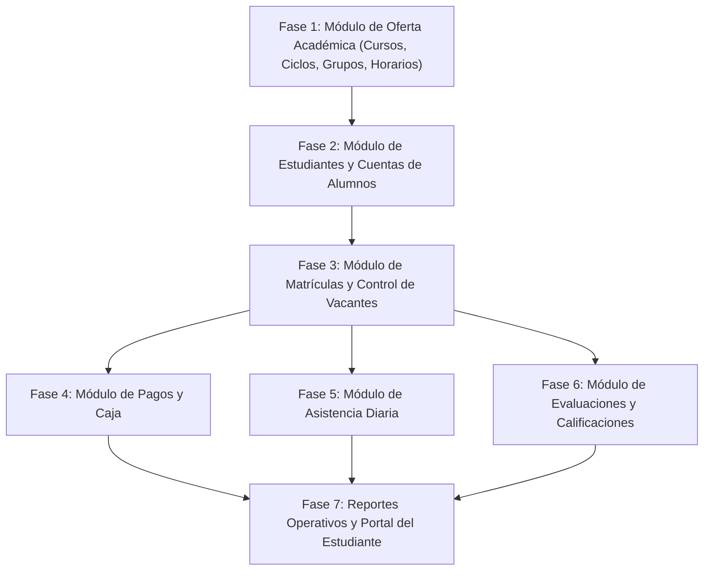

# REVISIÓN Y ANÁLISIS INTEGRAL DEL BACKEND
## Sistema de Gestión Administrativa y Académica para Academias

---

## 1. ESTADO ACTUAL DEL BACKEND

### 1.1. Lo que está completamente implementado y verificado
* **Configuración del Entorno y Servidor:**
  * Servidor Express configurado con TypeScript, CORS, JSON parsers y manejo de variables de entorno con `dotenv`.
  * Middleware de rutas no encontradas (`404`) y middleware global de manejo de excepciones y errores HTTP.
  * Verificación de conexión automática a MySQL al inicializar el servidor (`src/server.ts`).
  * Script de población inicial (`src/config/seed.ts` vía `npm run seed`) que crea el usuario Administrador (`admin` / `admin`) con contraseña hasheada en bcrypt.
* **Capa de Conexión a Base de Datos:**
  * Pool de conexiones robusto y optimizado con `mysql2/promise` (`src/config/database.ts`).
  * Script SQL completo con las 15 tablas relacionales, llaves foráneas con borrado en cascada en perfiles y restricciones únicas estrictas (`database.sql`).
* **Módulo de Autenticación y Control de Acceso:**
  * Modelo completo de datos e interfaces TypeScript para roles (`ADMINISTRADOR`, `ADMINISTRATIVO`, `DOCENTE`, `ESTUDIANTE`) y estados (`ACTIVO`, `INACTIVO`).
  * Repositorio de Usuarios (`usuario.repository.ts`) con resolución polimórfica de perfil según el rol asignado.
  * Servicio de Autenticación (`auth.service.ts`) con verificación de existencia, comprobación de estado activo, comparación de hash con `bcryptjs`, resolución de perfil y emisión de JWT firmado.
  * Middlewares de seguridad: `authenticateToken` (validación de JWT) y `authorizeRoles` (control de acceso basado en roles).
  * Controlador y rutas de autenticación (`POST /api/auth/login` y `GET /api/auth/me`).
* **Scaffolding Base de Módulos Futuros:**
  * Estructura limpia de controladores, servicios, repositorios y rutas creadas como plantilla base para evitar referencias rotas en `src/app.ts`.

### 1.2. Lo que está pendiente por implementar en la lógica de negocio
* **Módulo de Estudiantes y Cuentas:** Registro integral de estudiante + creación transaccional simultánea de su registro en `Usuario`, generación correlativa de código de estudiante (`EST-XXXX`), validación de duplicidad de DNI y username, actualización de datos de contacto y desactivación lógica.
* **Módulo de Matrículas:** Validación en tiempo real del aforo del grupo (`capacidad - matriculas_activas > 0`), validación de duplicidad por `UNIQUE(estudiante_id, grupo_id, ciclo_id)`, generación de código de matrícula (`MAT-YYYY-XXXX`), registro simultáneo opcional del pago inicial y cambio de estado (`ACTIVA`, `CANCELADA`, `RETIRADA`).
* **Módulo de Oferta Académica (Cursos, Ciclos, Grupos, Horarios):** CRUD de cursos y ciclos, apertura de grupos con aforo configurable, validación de solapamiento de horarios por docente y por aula.
* **Módulo de Pagos y Caja:** Códigos por cuota y registro en secretaría de cobros recibidos por efectivo, Yape o transferencia, con consulta de cuentas por cobrar y anulación sin eliminación física.
* **Módulo de Asistencia:** Apertura de sesiones por fecha (`UNIQUE(grupo_id, fecha)`), guardado borrador, cierre definitivo con bloqueo de edición y consulta de porcentaje de asistencias.
* **Módulo de Evaluaciones y Calificaciones:** Ciclo de vida de evaluaciones (`BORRADOR` -> `PUBLICADA`), ingreso de notas en escala vigesimal (0.00 - 20.00), cálculo de promedios ponderados/simples y reapertura administrativa.

---

## 2. ESTRUCTURA ACTUAL DE CARPETAS Y ARCHIVOS

```
backend/
├── package.json
├── tsconfig.json
├── .env
├── .env.example
├── .gitignore
├── database.sql
└── src/
    ├── config/
    │   ├── database.ts              # Pool de conexiones MySQL con mysql2/promise
    │   └── seed.ts                  # Script de inserción del usuario Administrador inicial
    ├── types/
    │   └── index.ts                 # Interfaces de dominio, DTOs, Enums de roles y Request extendido
    ├── middlewares/
    │   ├── auth.middleware.ts        # Validación de JWT y autorización basada en roles
    │   ├── not-found.middleware.ts   # Manejador de rutas 404
    │   └── error.middleware.ts       # Manejador centralizado de errores HTTP y excepciones
    ├── repositories/
    │   ├── usuario.repository.ts     # Consultas SQL para Usuario y carga de perfiles específicos
    │   ├── estudiante.repository.ts  # Consultas SQL para Estudiante (base inicial)
    │   ├── docente.repository.ts     # Consultas SQL para Docente (base inicial)
    │   ├── academico.repository.ts   # Consultas SQL para Cursos, Ciclos y Grupos (base inicial)
    │   ├── matricula.repository.ts   # Consultas SQL para Matrículas (base inicial)
    │   ├── pago.repository.ts        # Consultas SQL para Pagos (base inicial)
    │   └── evaluacion.repository.ts  # Consultas SQL para Evaluaciones y Notas (base inicial)
    ├── services/
    │   ├── auth.service.ts           # Lógica de login, hash de password y generación de JWT
    │   ├── usuario.service.ts        # Lógica de gestión de usuarios
    │   ├── estudiante.service.ts     # Lógica de gestión de estudiantes
    │   ├── docente.service.ts        # Lógica de gestión de docentes
    │   ├── academico.service.ts      # Lógica de cursos, ciclos y horarios
    │   ├── matricula.service.ts      # Lógica de matrículas y control de vacantes
    │   ├── pago.service.ts           # Lógica de pagos y finanzas
    │   └── evaluacion.service.ts     # Lógica de notas y asistencia
    ├── controllers/
    │   ├── auth.controller.ts        # Endpoints /api/auth/login y /api/auth/me
    │   ├── usuario.controller.ts     # Endpoints /api/usuarios
    │   ├── estudiante.controller.ts  # Endpoints /api/estudiantes
    │   ├── docente.controller.ts     # Endpoints /api/docentes
    │   ├── academico.controller.ts   # Endpoints /api/academicos
    │   ├── matricula.controller.ts   # Endpoints /api/matriculas
    │   ├── pago.controller.ts        # Endpoints /api/pagos
    │   └── evaluacion.controller.ts  # Endpoints /api/evaluaciones
    ├── routes/
    │   ├── auth.routes.ts            # Enrutador Express de autenticación
    │   ├── usuario.routes.ts         # Enrutador Express de usuarios
    │   ├── estudiante.routes.ts      # Enrutador Express de estudiantes
    │   ├── docente.routes.ts         # Enrutador Express de docentes
    │   ├── academico.routes.ts       # Enrutador Express académico
    │   ├── matricula.routes.ts       # Enrutador Express de matrículas
    │   ├── pago.routes.ts            # Enrutador Express de pagos
    │   └── evaluacion.routes.ts      # Enrutador Express de evaluaciones
    ├── app.ts                        # Configuración de Express, middlewares globales y montaje de rutas
    └── server.ts                     # Punto de entrada, prueba de conexión a MySQL y arranque del puerto
```

---

## 3. ARQUITECTURA Y FLUJO DE DATOS

El backend sigue un estricto patrón en capas con separación de responsabilidades unidireccional:

$$\text{Cliente HTTP} \longrightarrow \text{Routes} \longrightarrow \text{Controllers} \longrightarrow \text{Services} \longrightarrow \text{Repositories} \longrightarrow \text{MySQL Database}$$

### 3.1. Responsabilidad de cada capa:
1. **Routes (`src/routes/`):** Define los endpoints, métodos HTTP (`GET`, `POST`, `PUT`, `DELETE`) y aplica los middlewares (`authenticateToken`, `authorizeRoles`).
2. **Controllers (`src/controllers/`):** Recibe el `Request`, extrae parámetros/body, invoca al Servicio correspondiente y envía la respuesta HTTP estructurada con su código de estado (`200`, `201`, `400`, `401`, `403`, `404`, `500`). Cualquier excepción es delegada con `next(error)`.
3. **Services (`src/services/`):** Contiene las reglas de negocio puras, validaciones lógicas (vacantes, cruces de horario, estados permitidos), control de transacciones de base de datos y algoritmos de cálculo.
4. **Repositories (`src/repositories/`):** Ejecuta consultas SQL parametrizadas directas al pool de conexiones de `mysql2`, aislando completamente a los servicios de la sintaxis SQL.

### 3.2. Evaluación de coherencia:
* **Cumplimiento:** No hay llamadas directas de controladores a repositorios ni de rutas a servicios. La separación es 100% limpia.
* **Instanciación:** Cada clase exporta tanto su tipo como una instancia singleton predeterminada (`export const authService = new AuthService();`), permitiendo inyección de dependencias para pruebas unitarias sin sobrecargar la memoria.

---

## 4. ANÁLISIS DEL MÓDULO DE AUTENTICACIÓN

### 4.1. Flujo de Login (`POST /api/auth/login`)
1. **Entrada de datos:** Recibe `nombre_usuario` y `password` en el cuerpo de la petición.
2. **Búsqueda del Usuario:** `UsuarioRepository.findByNombreUsuario()` busca en la tabla `Usuario`. Si no existe, retorna error `401: Credenciales inválidas`.
3. **Validación de Estado:** Si `usuario.estado === 'INACTIVO'`, rechaza con `403: La cuenta se encuentra inactiva`.
4. **Validación Criptográfica:** Compara la contraseña en texto plano con el hash almacenado mediante `bcryptjs.compare()`. Si no coincide, retorna `401: Credenciales inválidas`.
5. **Carga Polimórfica de Perfil:** Según el `rol` del usuario (`ADMINISTRADOR`, `ADMINISTRATIVO`, `DOCENTE` o `ESTUDIANTE`), consulta la tabla correspondiente (`Administrador`, `PersonalAdministrativo`, `Docente` o `Estudiante`) para adjuntar su nombre, DNI y atributos personales.
6. **Emisión de JWT:** Genera un JSON Web Token firmado con `JWT_SECRET` y expiración (`JWT_EXPIRES_IN`, default `8h`), con el payload:
   ```json
   {
     "id": 1,
     "nombre_usuario": "admin",
     "rol": "ADMINISTRADOR",
     "perfil_id": 1
   }
   ```
7. **Respuesta generada:**
   ```json
   {
     "success": true,
     "message": "Inicio de sesión exitoso",
     "data": {
       "token": "eyJhbGciOiJIUzI1NiIsInR5cCI6...",
       "usuario": {
         "id": 1,
         "nombre_usuario": "admin",
         "rol": "ADMINISTRADOR",
         "estado": "ACTIVO",
         "perfil": {
           "id": 1,
           "usuario_id": 1,
           "nombres": "Administrador",
           "apellidos": "Principal",
           "dni": "00000000",
           "correo": "admin@academia.com"
         }
       }
     }
   }
   ```

### 4.2. Protección de Rutas y Autorización por Rol
* **`authenticateToken`:** Extrae el encabezado `Authorization: Bearer <token>`, valida la firma criptográfica y decodifica el usuario en `req.user`.
* **`authorizeRoles(...rolesPermitidos)`:** Comprueba si `req.user.rol` coincide con los roles autorizados para el endpoint. Si no coincide, responde inmediatamente con `403 Forbidden`.

---

## 5. REVISIÓN DE BASE DE DATOS Y COMPATIBILIDAD SQL

### 5.1. Compatibilidad con el Esquema Definitivo
Las 15 tablas y relaciones del esquema SQL están contempladas:
* `Usuario` $\leftrightarrow$ `Administrador` (1 a 1 vía `usuario_id UNIQUE`)
* `Usuario` $\leftrightarrow$ `PersonalAdministrativo` (1 a 1 vía `usuario_id UNIQUE`)
* `Usuario` $\leftrightarrow$ `Docente` (1 a 1 vía `usuario_id UNIQUE`)
* `Usuario` $\leftrightarrow$ `Estudiante` (1 a 1 vía `usuario_id UNIQUE`)
* `Curso`, `Docente`, `CicloAcademico` $\rightarrow$ `Grupo` (llaves foráneas con campo `capacidad`)
* `Grupo` $\rightarrow$ `Horario` (`dia_semana`, `hora_inicio`, `hora_fin`, `aula`)
* `Estudiante`, `Grupo`, `CicloAcademico` $\rightarrow$ `Matricula` (`UNIQUE(estudiante_id, grupo_id, ciclo_id)`)
* `Matricula` $\rightarrow$ `Pago` (`monto`, `metodo_pago`, `estado`)
* `Grupo` $\rightarrow$ `SesionAsistencia` (`UNIQUE(grupo_id, fecha)`) $\rightarrow$ `DetalleAsistencia` (`UNIQUE(sesion_asistencia_id, estudiante_id)`)
* `Grupo` $\rightarrow$ `EvaluacionNotas` $\rightarrow$ `DetalleNota` (`UNIQUE(evaluacion_id, estudiante_id)`)

### 5.2. Seguridad contra Inyección SQL
Todas las consultas en los repositorios utilizan consultas preparadas mediante `pool.execute(query, [params])`, garantizando protección nativa contra inyecciones SQL.

---

## 6. INVENTARIO DE DEPENDENCIAS

| Dependencia | Tipo | Versión | Estado de Uso | Justificación |
| :--- | :--- | :--- | :--- | :--- |
| **`express`** | Producción | `^4.21.2` | En uso | Framework web HTTP central |
| **`mysql2`** | Producción | `^3.12.0` | En uso | Driver de conexión a MySQL con soporte de promesas |
| **`bcryptjs`** | Producción | `^2.4.3` | En uso | Hashing y verificación de contraseñas (100% puro JS, sin problemas de compilación C++) |
| **`jsonwebtoken`** | Producción | `^9.0.2` | En uso | Creación y verificación de tokens de sesión JWT |
| **`dotenv`** | Producción | `^16.4.7` | En uso | Carga de variables de entorno desde `.env` |
| **`cors`** | Producción | `^2.8.5` | En uso | Habilitación de peticiones cruzadas desde el frontend Next.js |
| **`typescript`** | Desarrollo | `^5.7.3` | En uso | Tipado estático y compilador de TypeScript |
| **`tsx`** | Desarrollo | `^4.19.3` | En uso | Ejecución rápida en desarrollo con recarga en caliente (`watch`) |
| **`@types/...`** | Desarrollo | Recientes | En uso | Definiciones de tipos para Express, Node, CORS, JWT y Bcryptjs |

> **Evaluación de dependencias:** No existe ninguna librería redundante, pesada ni innecesaria. El proyecto se mantiene simple, ligero y estandarizado.

---

## 7. ANÁLISIS DE PROBLEMAS, RIESGOS Y MEJORAS

### 🔴 Crítico (Debe ser abordado al implementar la lógica de negocio)
1. **Manejo de Transacciones ACID en Operaciones Compuestas:**
   * Al registrar un nuevo estudiante, se debe insertar primero en `Usuario` y luego en `Estudiante` (o en `Matricula` y `Pago`). Si la segunda inserción falla, la primera debe revertirse mediante `ROLLBACK` para evitar usuarios huérfanos o datos corruptos.
   * **Solución:** Utilizar conexiones transaccionales de `mysql2`: `const conn = await pool.getConnection(); await conn.beginTransaction(); ... await conn.commit(); conn.release();`.

### 🟡 Importante (Para robustez y tipado estricto)
1. **Definición de DTOs con Validación de Entrada:**
   * Los controladores deben validar que campos requeridos (como DNI de 8 dígitos, formato de correo, capacidad mayor a 0, notas entre 0 y 20) vengan presentes y con tipos válidos antes de pasarlos al servicio.
2. **Reemplazo de tipos `any[]` en Repositorios Scaffolded:**
   * En `academico.repository.ts`, `matricula.repository.ts`, etc., los métodos base provisionales usan `any[]`. Deben migrarse a interfaces tipadas (`IMatriculaDTO`, `IGrupoDetalle`, etc.) en `src/types/index.ts`.

### 🟢 Mejora (Buenas prácticas y mantenibilidad)
1. **Estandarización de Respuestas:**
   * Asegurar que todos los controladores devuelvan la estructura unificada `ApiResponse<T>`: `{ success: true, message?: string, data?: T }`.

---

## 8. PREPARACIÓN PARA EL MÓDULO DE ESTUDIANTES Y MATRÍCULAS

### 8.1. Módulo de Estudiantes (`estudiante.*.ts`)
* **Responsabilidades:**
  * Búsqueda predictiva por DNI o Código de estudiante.
  * Registro integral de estudiante: Generación automática o manual de credenciales de usuario con rol `ESTUDIANTE` y hash de contraseña.
  * Validación de unicidad de DNI en tabla `Estudiante` y `nombre_usuario` en tabla `Usuario`.
  * Generación correlativa del código de estudiante (ej: `EST-2026-0001` o correlativo según timestamp/contador).
  * Actualización de datos personales y de contacto.
  * Desactivación lógica (cambio de estado a `INACTIVO` tanto en `Estudiante` como en `Usuario`).
* **Permisos requeridos:** Solo accesible por rol `ADMINISTRATIVO` (gestión) y `ADMINISTRADOR` (supervisión).

### 8.2. Módulo de Matrículas (`matricula.*.ts`)
* **Responsabilidades:**
  * Validación de existencia y estado activo del `Estudiante`.
  * Validación de existencia y estado activo del `Grupo` y del `CicloAcademico`.
  * **Control de Vacantes en Tiempo Real:** `SELECT COUNT(*) FROM Matricula WHERE grupo_id = ? AND estado = 'ACTIVA'`. Verificar que `matriculas_activas < Grupo.capacidad`. Si no hay vacantes, denegar la matrícula.
  * **Control de Duplicidad:** Validación de la restricción `UNIQUE(estudiante_id, grupo_id, ciclo_id)` para impedir doble matrícula activa en la misma materia/sección.
  * Generación de código correlativo de matrícula único (ej: `MAT-2026-0001`).
  * Registro opcional del pago inicial enlazado (`Pago.matricula_id`) dentro de la misma transacción.
  * Gestión de estados de matrícula: `ACTIVA`, `CANCELADA`, `RETIRADA`.

### 8.3. Dependencias con lo ya existente
* Depende directamente de `pool` (`src/config/database.ts`) para transacciones.
* Reutiliza `bcryptjs` para el hash de la clave del nuevo estudiante.
* Utiliza los middlewares `authenticateToken` y `authorizeRoles('ADMINISTRATIVO', 'ADMINISTRADOR')`.
* Requiere extender `src/types/index.ts` con los DTOs: `CreateEstudianteDTO`, `UpdateEstudianteDTO`, `CreateMatriculaDTO`, `CambiarEstadoMatriculaDTO`.

---

## 9. PLAN DE CONTINUACIÓN RECOMENDADO



### Orden recomendado de desarrollo:

1. **Paso 1: DTOs y Tipos Transaccionales (`src/types/index.ts`):** Definir los contratos exactos para Estudiantes, Matrículas, Grupos y Pagos.
2. **Paso 2: Módulo de Oferta Académica (Cursos, Ciclos y Grupos):** Para que existan ciclos y grupos con aforo real donde poder matricular.
3. **Paso 3: Módulo de Estudiantes (con creación transaccional de Usuario):** Registro completo de alumnos y credenciales.
4. **Paso 4: Módulo de Matrículas:** Verificación de vacantes, asignación de grupo y generación de código de matrícula.
5. **Paso 5: Módulo de Pagos:** Emisión de cuotas y registro de ingresos de caja.
6. **Paso 6: Módulos Académicos del Docente:** Asistencia y Evaluaciones.
